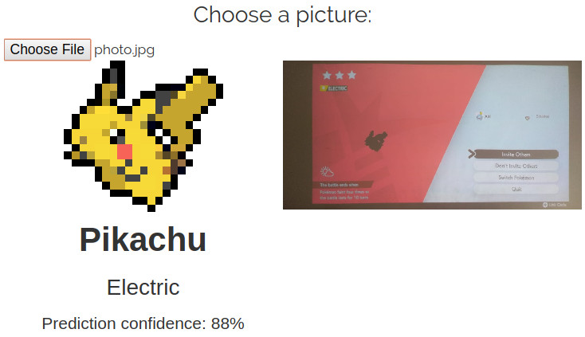

# PokeRSI - Pokemon Raid Shadow Identifier

This is the source code of the core components used in the website [www.poke-rsi.com](https://www.poke-rsi.com).

The picture below shows the website interface.



This is a tool for identifying which pokémon is going to appear in a raid battle in Pokemon Sword and Shield.
It works by uploading a picture of the screen showing the pokémon shadow that appears before the battle.

This tool was developed using Javascript and OpenCV.

## Usage

If you just want to see it working, then you should visit [www.poke-rsi.com](https://www.poke-rsi.com).

If, on the other hand, you want to run the code on your own computer, then follow the steps below. These instructions are for a computer using a terminal on a Linux system, if you are using Windows or Mac, you may have to adapt the commands below.

1. Clone this repo into your computer:
```bash
git clone https://github.com/zentos1/poke-rsi-js.git
```

2. Enter the downloaded folder:
```bash
cd poke-rsi-js
```

3. Start a local http server in the folder. There are many ways of doing this, but the simplest one is by using Python. If you already have Python 3 installed, then just type:
```bash
python3 -m http.server
```
If not, then I recommend you follow the instructions in the section "Running a simple local HTTP server" in [this tutorial](https://developer.mozilla.org/en-US/docs/Learn/Common_questions/set_up_a_local_testing_server).

4. Now open your browser, enter the address given by your local server, and you should see the main page of PokeRSI. For example, if you are using the Python server, then go to: [http://0.0.0.0:8000](http://0.0.0.0:8000).

## How does it work?

Read this section if you want to have a general idea about how this tool identifies the shadows in the pictures.

This tool just uses some simple image processing techniques to extract the shadow from the picture and match it with a database of known shadows. The sections below briefly explain each of the steps involved.

### Database of known shadows

This information comes from the file `sprites.png`. We split this image into several crops, each containing a single pokémon inside. Then we binarize all the crops (turn them into black and white). Each crop will be the reference shadow for one pokémon.

### Cropping the shadow from the picture

We need to extract only the shadow area from the picture that the user uploaded, so that we can compare it to the database. This is done based mainly on two assumptions:

1. The shadow is a dark (black) region surrounded by a brighter background.
2. The size of the shadow is inside a known interval (after resizing the image to a canonical size).
   
That is basically all. We check the whole picture and collect the areas that satisfy the criteria above the most. This part of the code is in `binarize.js`, you can take a look at the code if you want to know more specific details.

### Matching the crop with the database

We binarize the crop from the previous step and compare it with all the shadows in the database to see which one is the most similar. In order to make the tool a little more robust, we do several tries for each image by modifying some parameters such as the threshold values and by rotating the image in multiples of 90 degrees.

After all comparisons, we keep and show the database entry that produced the best match with the crop. The matching score (or prediction confidence) is computed using the [IoU - Intersection over Union](https://en.wikipedia.org/wiki/Jaccard_index). This part of the code is in `match.js`.

## Known issues

This tool can fail in some situations, including, but not limited to:

- Rotated images: we do not check for image rotation or perspective transformations, so any picture that is not well aligned to the horizontal/vertical axes will most likely fail.
- Change in brightness: the assumption about image colors may be invalid if the contrast of the image is not high enough or if the picture presents some illuminance disturbances, such as light reflection on the screen.
- Image quality: artifacts in the picture may affect the results, for example images of low resolution or containing some noise.

## Disclaimer

This is an UNOFFICIAL tool, and it is not affiliated in any way to Nintendo, Game Freak, the Pokémon Company, or to any other official representative for Pokémon.

I do not hold any rights regarding the images, names, or any other kind of information related to Pokémon.

## License

The code is licensed under the [MIT License](LICENSE).

I do not own the rights of the image with the sprites. It was collected from: [https://i.kym-cdn.com/photos/images/original/001/635/395/bcf.png](https://i.kym-cdn.com/photos/images/original/001/635/395/bcf.png).